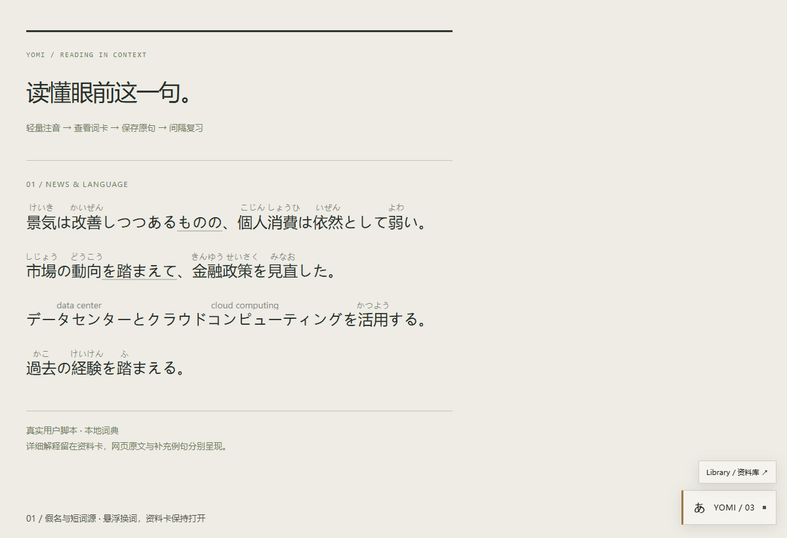
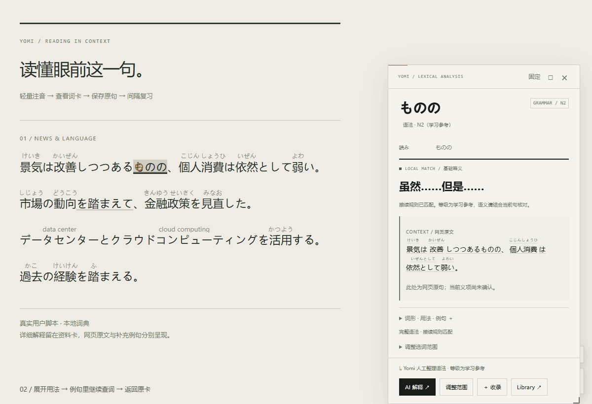
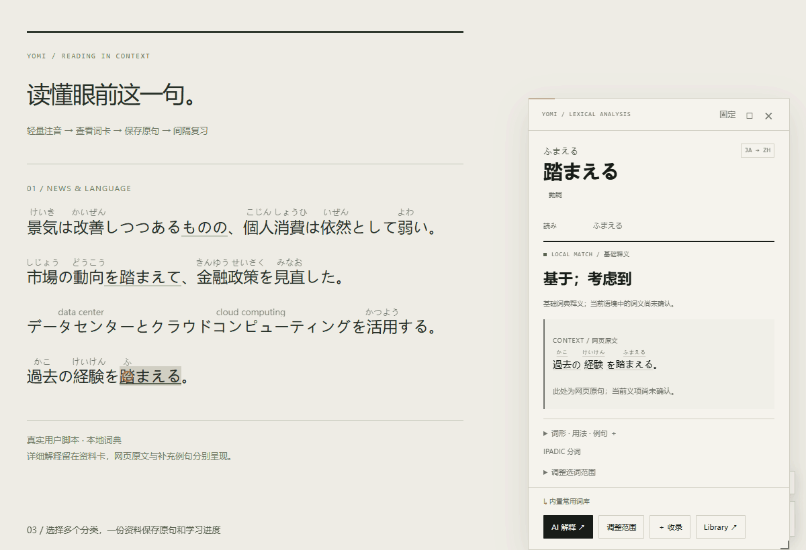

<p align="center">
  
</p>

<h1 align="center">Yomi · 日英阅读助手</h1>

<p align="center">把读过的网页，变成自己的语言学习材料。</p>
<p align="center">日语假名与词源 · 中文词卡 · 例句探索 · 多分类 Library · 间隔复习</p>

<p align="center">
  <a href="#安装与更新">安装与更新</a> ·
  <a href="#功能展示">功能展示</a> ·
  <a href="#可选-ai">AI 配置</a> ·
  <a href="#支持范围">支持范围</a>
</p>

Yomi 是运行在网页上的日语／英语阅读辅助用户脚本。阅读时看轻量注音，遇到生词就悬停查询；把值得记住的词汇和语法连同原句收录，再按自己的节奏复习。

**阅读优先。** 正文只承载短注音和当前词的轻微强调，详细释义、用法和例句放在独立资料卡里。基础功能无需配置 AI。

## 功能展示

以下 GIF 录制自实际编译脚本，展示真实的鼠标操作、词卡切换、收录与复习。使用本地词典和演示页，不模拟 AI 答案；橙色圆圈标示鼠标位置。保留静态截图链接，方便暂停细看。

### 01 · 留在原文里，读懂词与语法

日语汉字标注平假名，可靠的片假名外来语显示短原词。悬停后，正文强调当前查询对象，资料卡显示中文释义、接续、用法和例句。支持 14 条经过接续检查的语法模式，包括「ものの」「ざるを得ない」「を踏まえて」等。



[查看完整语法卡静态截图](verification/saved-cards/grammar-card.png)

自动注音与查询相互独立：没有注音的普通日英文本仍可查询；词典未命中会显示明确结果，并提供 AI 解释、调整范围和划词入口。

### 02 · 例句里遇到新词，继续向下探索

例句中的词也能悬停或点击，打开独立子词卡，再逐层返回。原卡保留，阅读思路不被打断。卡内日语词汇可显示假名；英语词卡支持 UK／US 音标及来源标识，缺失时明确提示。



[查看例句子卡静态截图](verification/interactions/japanese-child.png)

主卡、子卡、设置和 Library 均可拖动、调整大小、最大化与还原。支持深浅色主题与减少动态效果设置。

### 03 · 一个词，放进多个自己的分类

点击「＋ 收录」，选择「英语」「新闻」「金融」「IT」等自定义分类，也可现场新建。同一个词属于多个分类时，共用一份释义、原句和学习进度。



[查看多分类收录静态截图](verification/categories/collect-multiple.png)

Library 统一管理词汇、语法、外来语、英语和自定义资料。分类支持新增、改名、移除；移除分类不删除词条。点击条目回到完整词卡，编辑入口独立，搜索支持原文、假名、中文、词源、标签和保存的原句。

[查看 Library 分类栏静态截图](verification/categories/library-sidebar.png)

### 04 · 用自己读过的原句复习

保存网页原句、前后句、标题和来源链接。复习支持原文→中文、中文→原文、原句挖空、语法选择与语境理解；按「忘记／困难／一般／简单」调整下一次复习。

[查看原句挖空与四级评分静态截图](verification/iteration-3/review-cloze.png)

自然遇见与正式复习分别计数。揭晓答案后可以进入完整词卡，再返回当前题目。当前使用自适应基础调度器，并非 FSRS。

## 安装与更新

1. 安装用户脚本管理器：[Tampermonkey（篡改猴）](https://www.tampermonkey.net/) 或 [ScriptCat（脚本猫）](https://scriptcat.org/)。
2. 打开仓库中的 [编译脚本](dist/yomi-reader.user.js)，点击 **Raw** 查看完整代码。若管理器接管链接，按提示安装；否则复制全部代码，在管理器中新建脚本、替换默认内容并保存。
3. 刷新一张日语或英语网页，右下角出现 **YOMI / 03** 后即可使用。日语分词词典首次加载需要网络，下载成功后缓存。
4. 更新旧版时，直接编辑已有 Yomi 脚本并用最新版代码覆盖。保持名称、namespace 和存储键不变，以保留设置及学习数据。

项目更新记录已到 **3.0.8**（新增图标）；当前编译脚本的版本标识仍为 **3.0.7**。请只启用一份 Yomi；本仓库代码可直接安装，不依赖在脚本市场中搜索到条目。

### 第一次使用

| 操作 | 效果 |
| --- | --- |
| 悬停词汇或语法 | 查看中文资料卡；鼠标移入卡片时保留原词强调 |
| 点击「固定」／按 Esc | 固定当前卡片／关闭最上层词卡 |
| 选择文本后按 Alt+Y | 查询指定词、短语或句子，最多 500 字符 |
| 点击「＋ 收录」 | 选择多个分类，连同当前网页语境保存 |
| 打开 Library | 搜索、分类、回看完整卡片或进入间隔复习 |
| 打开 YOMI 设置 | 调整注音、主题、站点开关及可选 AI |

关闭「自动注音」后仍能查询；关闭「当前站点启用」才会暂停本站增强。

## 可选 AI

基础注音、常用词释义、收藏和复习可以先直接使用。需要解释未收录的词，或补充语境、义项与例句时，再接入支持 **Chat Completions** 的服务。

在设置 → **02 AI 服务** 中填写完整 API 地址、密钥和模型 ID，启用 AI，测试连接后保存。已加入 DeepSeek Flash 的 JSON 返回兼容处理；不同服务与代理仍可能需要调整配置。

- 默认不启用 AI，也不发送整页或整个资料库。
- 「附带附近原文」默认关闭；开启后仅发送查询附近的有限上下文。
- 「自动补全未知片假名」需单独开启，会发送受数量限制的词列表。
- AI 释义、读音和词源均标记推断来源；不确定的长解释不会被塞进正文注音。
- 收藏卡的 AI 补充可点击「保存本次补充」保存，读音与音标也可手动修正。

## 支持范围

| 能力 | 当前边界 |
| --- | --- |
| 语言 | 自动分析日语、英语；可自建其他语言分类并手动收录，但不会因此自动获得对应语言的分词和注音 |
| 词典与语境 | 内置常用词库并非完整日汉／英汉词典；基础词义与已确认的语境词义会区分，专名和复杂表达仍可能需要调整范围 |
| 英语音标 | 支持 UK／US 两组字段；本地起始集仅含 learn、policy、power，其余来自已保存资料、手动输入或 AI，不保证全词覆盖 |
| 网页兼容 | 主要处理普通网页文本与动态内容；图片、Canvas、PDF／特殊阅读器、iframe、网页 Shadow DOM 和编辑区不处理 |
| 正文排版 | 注音不放长释义；紧密行距只有限补偿。固定高度、裁切或特殊布局仍可能隐藏注音，可关闭注音保留查询 |
| 数据保存 | 安装版保存在脚本管理器中，在匹配网站间复用；演示版使用同源 IndexedDB。清除相应存储会删除数据 |

遇到无法识别的词，可以调整选词范围或划词查询；“能打开查询入口”不等于“词典一定命中”或“语言分析一定正确”。

## 本地体验与开发

```sh
pnpm install
pnpm build
pnpm demo
```

启动后打开 [本地演示](http://127.0.0.1:4173/) 或 [阅读—收录—复习页面](http://127.0.0.1:4173/learning.html)。页面加载实际编译脚本，开发时可用 `pnpm test` 运行单元测试。

更多实测记录：[卡片回看与发音](verification/SAVED-CARDS.md) · [自定义分类](verification/CATEGORIES.md) · [注音与多义项](verification/PRECISION.md) · [学习与复习验收](verification/ITERATION-3.md)。

<details>
<summary>完整使用说明、AI 发送范围、兼容限制与开发测试命令</summary>

### 日常使用

- 本地结果约 25ms，未知词默认等待 250ms（可调 150–700ms）后查询**支持范围内的普通日英文本**。查询不要求词语有注音，也不要求本地词典命中。
- 词卡优先靠视口右侧停靠；目标靠近右边缘时自动换到其左侧。首次滑入约 220ms，换词只更新内容。正文 active 高亮保留到换词、关闭或点击空白处；「固定」后冻结当前词卡；Esc 约 180ms 退场。
- 主体显示中文释义。基础词库结果会注明「尚未确认语境词义」，AI 结果注明推断来源。
- 展开「词形 · 用法 · 例句」查看次级内容；「调整范围」允许切换候选或输入单词、短语、句子。
- 「网页原文」与「补充例句」分开显示。结构化条目逐个列出义项、用法、搭配与例句。AI 被要求为每个有把握的常见义项提供至少两条例句；实际数量和准确性仍依赖返回内容。旧词库未细分义项时显示已有释义要点和通用资料，可手动 AI 补充。没有原文发送授权时不宣称 AI 已确认当前义项。
- 所有面板可拖动顶部栏，阅读终端／资料库的大标题也可拖动；拖动边缘或四角调整大小，右下角有可见手柄。双击顶部栏或点击「□」最大化／还原。位置和尺寸在当前页面内关闭重开、切换内容后保留；刷新网页恢复初始窗口。移动不会自动冻结换词。
- 例句中的日英词语可悬停、点击或用 Tab / Enter 打开独立子词卡；子卡中的例句也能继续查询，最多保留 12 层返回记录。先按 Esc 关闭子卡，再按关闭主卡。收录会保存该例句及当前网页来源。
- **划词补救**：选择原文，点击「查询所选文本」，或按 `Alt+Y`，或使用脚本管理器的「查询已选文字」菜单。一次最多 500 字符。
- 设置中的「自动注音」关闭后，查询继续工作；「当前站点启用」关闭才会暂停所有能力。
- 注音字号、透明度、悬浮等待和深浅色主题均可调。动效尊重系统的减少动态效果设置。

日语分词使用本机 kuromoji/IPADIC，第一次从 jsDelivr 下载约 17.8 MB 压缩词典；成功后存入脚本管理器。加载失败仍可使用浏览器候选分词、英文基础词典、调整范围和划词查询，设置中的「重新扫描」可重试词典。

### 收录、Library 与 SRS

1. 在有释义的词卡点击 **＋ 收录**，勾选一个或多个分类后确认；也可直接新建分类。未勾选则进入「未分类」。原形、读音、语法 pattern 与当前/前后句、标题、URL、域名一同保存。已收录词可再次点「已收录 · 分类」调整归属。未知词可先 AI 解释，或到 Library 新建自定义项目。
2. 点击右下角 **Library / 资料库**，按词汇、语法、N1/N2、外来语、英语、自定义、待复习、已掌握筛选。搜索支持中文、假名、英文词源、标签、备注和已保存原句；列表每页 40 条。
3. 点击条目打开原来的完整资料卡，保留首次收录的网页原句和来源链接；「返回资料库」保留搜索与分类。列表右侧的「编辑」或卡片中的「编辑资料」修改释义、假名、UK／US 音标、标签、备注、分类与学习状态。分类变化保留原始识别身份以继续匹配网页。上下文每次加载 10 条。

Library 左侧自定义分类可以是语言、主题或项目，与词汇／语法等资料类型、标签彼此独立。点「管理分类」新增、改名或移除；移除只删除分类，不删除词条和复习记录。失去所有分类的词回到「未分类」。可用「＋ 自定义」保存韩语等其他语言的原文与释义，但新增分类不会自动增加该语言的分词或注音能力。
4. 同一页面会话的同一原形与句子只记一次自然遇见；新页面/刷新会话再查询可增加计数。它**不算正式复习**。只有已经收录、实际打开查询的项目计数，不追踪用户是否真的读过视口中的每个词。
5. 切到 **间隔复习**，选择题型并开始。默认先处理到期项目，再加入最多 20 个新项目。支持原文→中文、中文→原文、真实原句挖空、语法选择、语境理解。没有适用原句的项目会明确回退为正向题。
6. 显示答案后选择 **忘记 / 困难 / 一般 / 简单**。忘记回到 10 分钟；一般从 1 天、3 天进入自适应扩展；困难约 ×1.3，一般 ×2–2.5，简单 ×3–4。按钮预览下一间隔。新收录立即可练习，后续只在到期后入队。

卡片回看不增加自然遇见或正式复习次数。复习揭晓答案后显示发音资料，可进入完整卡片再返回当前题。日语卡内注音使用已保存读音或 IPADIC，不确定的专名仍可能缺失或读错。英语内置双音标仅含已核对的 `learn / policy / power` 起始条目，其他词使用已保存或 AI 返回的音标；缺少某种音标会显示「未收录」，不会根据拼写编造。音标若对应原形，会明确显示对应词。AI 推断会标记来源，在收藏卡点击「保存本次补充」才更新已保存资料。

SRS 为独立的自适应基础调度器，**不是 FSRS**。记录算法名、版本和预留状态，可将来迁移算法而不重建资料、上下文与历史。学习状态可暂停或手动标记掌握；自评「一般/简单」等不代表系统自动评估了语言水平。

安装版采用脚本管理器 GM 存储，在匹配的不同网站共用资料库；没有把大量数据放进 localStorage。64 个资料索引分片在启动时装入内存；原始条目、上下文与复习记录分开存储，后两者每 50 条一页。写操作按页协调，普通 Hover 查索引不访问持久层。演示版以 IndexedDB 实现同一存储接口，仅在同一演示 origin 下共享，端口改变即是另一份演示库。卸载脚本/清除管理器数据会删除安装版学习数据；演示库随浏览器站点数据清除。

### AI 配置与发送范围

打开设置 → **02 AI 服务**，填写完整的 Chat Completions API 地址、API Key 和模型 ID，启用 AI，测试连接，再保存。

| 设置 | 行为 |
| --- | --- |
| AI 开关（默认关） | 开启后悬浮生词可自动查询；本地命中词可手动请求 AI |
| API 地址 | 如 `https://你的服务商/v1/chat/completions`，必须填写完整路径 |
| 本机服务 | 支持 `http://127.0.0.1:端口/v1/chat/completions`，无认证时密钥可空 |
| 附带附近原文（默认关） | 开启才发送鼠标所在位置附近最多 240 字符；不发送整页 |
| 自动补全未知片假名（默认关） | 开启才发送可见及邻近区域的词列表，每页最多 60 词；仅自动注音开启时运行 |

划词或手动输入的整段文字是用户主动指定的查询内容，最多 500 字符。AI 推断的读音、词源与释义会明确标记；自动补全的可靠短原词用虚线提示。来源词必须独立提供、可信度至少 0.9、类型明确为 borrowed、不超过 28 字符及 3 个词；正文不接受自由说明文本。不确定时允许留空，不能保证模型判断正确。

接口发送 `POST`，使用 Bearer 认证；请求字段为 `model`、`messages`、`temperature`、`max_tokens`、`stream:false`。读取 `choices[0].message.content` 中的 JSON。其他服务协议可在 [`src/network.js`](src/network.js) 适配。

密钥存入脚本管理器；设置面板使用关闭的 Shadow DOM；外部文本通过 `textContent` 显示。跨域请求仅用于固定词典 CDN 和用户配置的 API；`@connect *` 支持自定义服务商，脚本管理器可能要求相应授权。

### 查询覆盖和准确性是三件不同的事

| 层面 | 当前行为与边界 |
| --- | --- |
| 查询入口覆盖 | 普通日英 Text 节点可通过指针定位查询；已有 ruby 可查；失败和未命中也有可见词卡。没有可用指针定位 API 时仍有划词入口 |
| 词典命中 | 内置中文词库是可扩充的常用词库，不是完整日汉/英汉词典。未命中使用 AI 或调整范围，不会凭空生成本地释义 |
| 语言分析准确性 | 日语使用 IPADIC 或浏览器分词；英语使用词形候选与已收录表达。专名、多义词、未知复合词和复杂短语仍可能切分错误，需要调整范围或划词 |

跨行内标签通过只读位置映射分析。注音只替换相应 Text 节点的局部内容，保留链接、加粗元素及其事件。同一汉字词跨标签时，整体读音只附在相应读音组的首片段上，不重复标给每个片段。

已支持的示例包括 `食べました → 食べる`、`children → child`、`looked it up → look up`、`well‑known`、`ﾊﾟﾜｰ → power`、被链接拆开的 `under` + `stand`。这些示例不代表所有词形和短语都能正确识别。

### 不在支持范围内或仍有约束的页面

- 图片、Canvas、PDF/特殊阅读器、浏览器内部页面、iframe（含跨域）和网页 Shadow DOM 不处理。
- 不处理输入框、编辑器、代码块、隐藏内容及 `translate="no"` 区域。
- 中文与日语共享汉字。纯汉字且无日语线索的段落不默认当作日语；可选择「日语（含纯汉字）」或主动划词。
- 只读上下文窗口有字符和节点上限，不跨块级段落拼词。极端拆分、非标准排版或超长连续词可能需要手动选词。
- 自动注音最多 30,000 个片段，单一 Text 节点超过 5,000 字符跳过自动注音；查询不依赖这个上限。
- 多行注音空间不足时只有限增加所在文字块的必要行距，不跨块增加顶部留白，不修改整站行高。补偿有上限，无法避让的特殊布局可能隐藏注音；横向无法容纳的长读音会省略，完整读音可在词卡查看。固定高度、裁切溢出或持续重写 DOM 的特殊组件仍可能裁切或移除注音；可关闭自动注音，保留查询。
- 页面顶层 CSS transform、特殊缩放或浏览器插件组合可能影响定位。已验证的缩放方式见验收报告，未把它等同于所有浏览器的工具栏缩放。
- 另一标签页更改设置后，当前页面需要刷新才读取新设置。

### 开发、演示与验收

```sh
pnpm install
pnpm build
pnpm demo
```

- 普通演示：[http://127.0.0.1:4173/](http://127.0.0.1:4173/)
- 阅读—收录—复习：[http://127.0.0.1:4173/learning.html](http://127.0.0.1:4173/learning.html)
- 可复现验收页：[http://127.0.0.1:4173/verification.html](http://127.0.0.1:4173/verification.html)
- 导航、拖动、例句子查询：[http://127.0.0.1:4173/interactions.html](http://127.0.0.1:4173/interactions.html)
- 多行注音与同步滚动：[http://127.0.0.1:4173/scrolling.html](http://127.0.0.1:4173/scrolling.html)
- 紧凑新闻列表与多义项：[http://127.0.0.1:4173/precision.html](http://127.0.0.1:4173/precision.html)
- 截图对比：[http://127.0.0.1:4173/compare.html](http://127.0.0.1:4173/compare.html)

页面都加载**同一份生产编译脚本**，不是静态模拟词卡。演示 shim 从本机依赖加载真实词典，AI 用 fetch，受浏览器 CORS 限制；安装版使用 `GM_xmlhttpRequest`。

```sh
pnpm test
pnpm test:browser
pnpm test:learning
pnpm test:ai
pnpm test:interactions
pnpm test:windows
pnpm test:scrolling
pnpm test:precision
pnpm test:categories
pnpm test:saved-cards
# 可选：联网检查截图中的内阁府原网站
pnpm test:cabinet
```

测试默认使用已安装的 Microsoft Edge 无头模式；可通过 `YOMI_BROWSER=chrome` 指定已安装 Chrome。真实分词词典参与测试，AI 成功、延迟及失败响应由测试拦截模拟，没有使用真实付费账户或验证用户实际安装的扩展。

本轮根因、数据模型、测试方法、真实截图和限制见 [`verification/ITERATION-3.md`](verification/ITERATION-3.md)。测试结果分别在 [`verification/iteration-3/results.json`](verification/iteration-3/results.json) 和 [`verification/regression-v3/results.json`](verification/regression-v3/results.json)。历史第二轮报告保留在 `verification/ITERATION-2.md`。

### 源码入口

- `src/annotation.js`：正文渲染的严格信任边界。
- `src/annotation-overlay.js`：原文局部注音锚点、逐行避让、最小局部行距与浏览器原生滚动跟随。
- `src/knowledge-view.js`：原文之外的义项、用法与多例句渲染；主卡与例句子卡共用。
- `src/pronunciation.js`：卡片假名、UK／US 音标、对应词和来源显示；不改动网页正文。
- `src/grammar.js`：14 条完整语法及接续检查。
- `src/highlight.js`：跨节点 Range 高亮与无布局回退层。
- `src/learning.js`、`src/storage-lock.js`：资料数据模型、索引、分页记录与跨页写协调。
- `src/learning-ui.js`、`src/quiz.js`、`src/scheduler.js`：统一资料库、五种题型及调度。

- [`src/text-engine.js`](src/text-engine.js)：鼠标 Text 定位、跨行内节点映射、NFKC 原文位置映射、候选及词形分析。
- [`src/main.js`](src/main.js)：查询会话、过时结果隔离、独立增量注音、选择/复制与状态管理。
- [`src/ui.js`](src/ui.js)、[`src/ui-styles.js`](src/ui-styles.js)：终端界面、主题、固定、定位及四种查询状态。
- [`src/lexicon.js`](src/lexicon.js)：日汉/英汉常用词、词源、词形候选和多词表达。
- [`src/tokenizer.js`](src/tokenizer.js)、[`src/network.js`](src/network.js)：词典加载缓存、AI 协议和请求去重。

本轮视觉参考为本地 `RhineLabUI-main` 的设计说明、CSS 与截图；未能直接观看 Bilibili 链接，不声称复刻视频细节。保留该参考目录原样。

实现依据：[Tampermonkey API](https://www.tampermonkey.net/documentation.php)、[kuromoji.js](https://github.com/takuyaa/kuromoji.js)、[MDN 指针文本定位](https://developer.mozilla.org/en-US/docs/Web/API/Document/caretPositionFromPoint)、[Intl.Segmenter](https://developer.mozilla.org/en-US/docs/Web/JavaScript/Reference/Global_Objects/Intl/Segmenter)。原创代码为 MIT；完整第三方许可同时放在脚本末尾和 `dist/THIRD-PARTY-NOTICES.txt`。


</details>

<details>
<summary>版本记录 · 3.0.1–3.0.8</summary>

3.0.1 修复 DeepSeek Flash 的 JSON 返回兼容问题：自动关闭思考并启用 JSON 输出、识别截断/空答案、最多补试一次。详见 [修复说明](verification/AI-JSON-FIX.md)。

3.0.2 修复导航按钮文字无法查询；有留白的单行标题恢复注音。主词卡和例句子词卡支持拖动，例句中的日英词语可继续查询、返回和收录。见 [交互修复与实测截图](verification/INTERACTIONS.md)。

**3.0.3 补齐导航的可见假名／词源标注**，阅读终端、Library／复习、主词卡、子词卡全部支持拖动、八向调整大小、最大化和还原，移除底部拖动禁区。见 [本次修正与真实截图](verification/WINDOWS.md)。

**3.0.4 修复多行注音重叠与滚动跟随延迟**。注音使用原文旁的局部锚点，与原文字形由浏览器同步滚动；逐行检测留白，只为拥挤的文字块补足最小行距，必要时补少量顶部留白，保持注音可见。关闭注音恢复脚本添加的间距。见 [修复与实测截图](verification/SCROLLING.md)。

**3.0.5 修正 3.0.4 的过量行距补偿**：只检测同一文字块的真实前行，取消跨块顶部补白，补偿上限为原行距加一份注音高度及 3px。同字号原文的注音大小一致，优先利用左右空白，无法容纳的长读音省略显示，完整读音可在词卡查看。词卡新增独立的网页原文区、按义项组织的用法和多例句；主卡、子卡和收录均支持新结构。见 [修复、截图和验收](verification/PRECISION.md)。

**3.0.6 新增自定义多分类**：收录时多选分类并可现场新建；Library 左侧统一切换分类，管理区支持新增、改名和移除。一个词在多个分类中共用同一份释义、上下文和复习进度。见 [分类 UI 与验收](verification/CATEGORIES.md)。

**3.0.7 收藏回到完整词卡**：点击条目恢复收录时的表达、释义、用法与原句，编辑操作独立。日语词头和卡内例句增加假名；英语显示 UK／US 音标及来源，未收录时明确留空，支持 AI 补充后保存及手动编辑。复习揭晓后可打开完整卡片，再返回当前题目。见 [实测截图与覆盖边界](verification/SAVED-CARDS.md)。

**3.0.8 新增icon**：新增精美图标😋

</details>

## 许可与致谢

原创代码采用 [MIT 许可](LICENSE)。日语分析使用 kuromoji／IPADIC；完整依赖许可见 [第三方声明](dist/THIRD-PARTY-NOTICES.txt)。界面视觉参考 RhineLabUI，项目保留相应来源说明。
