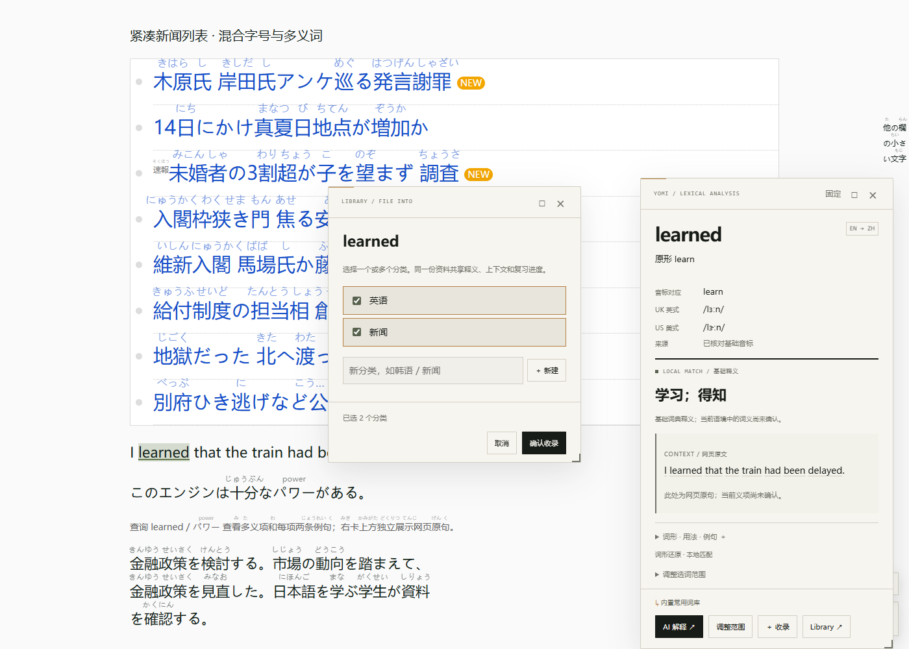
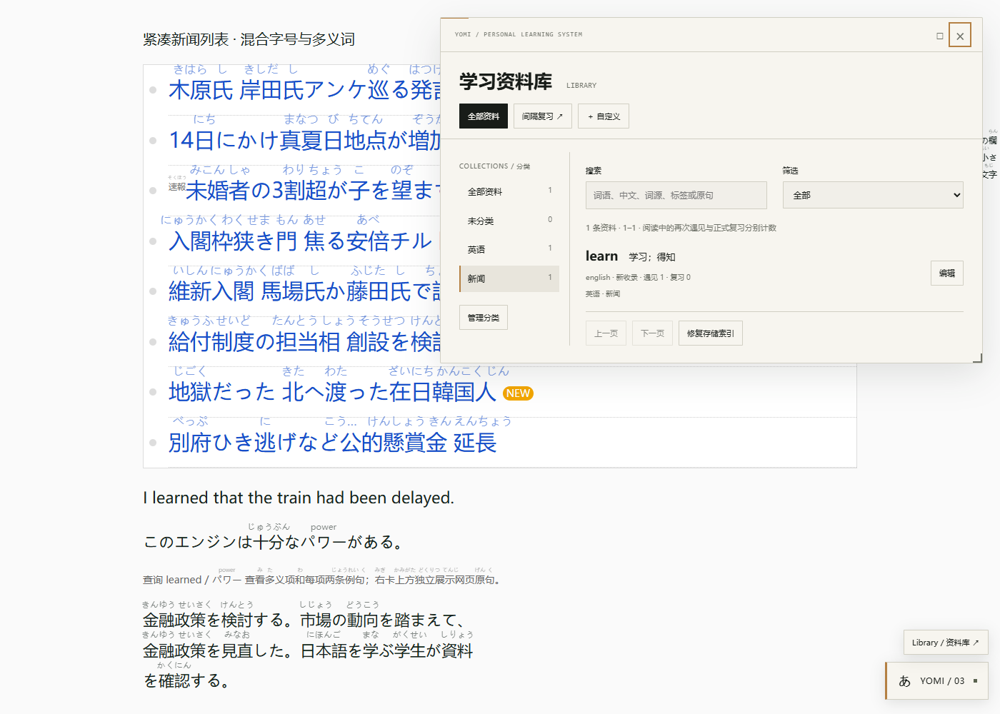
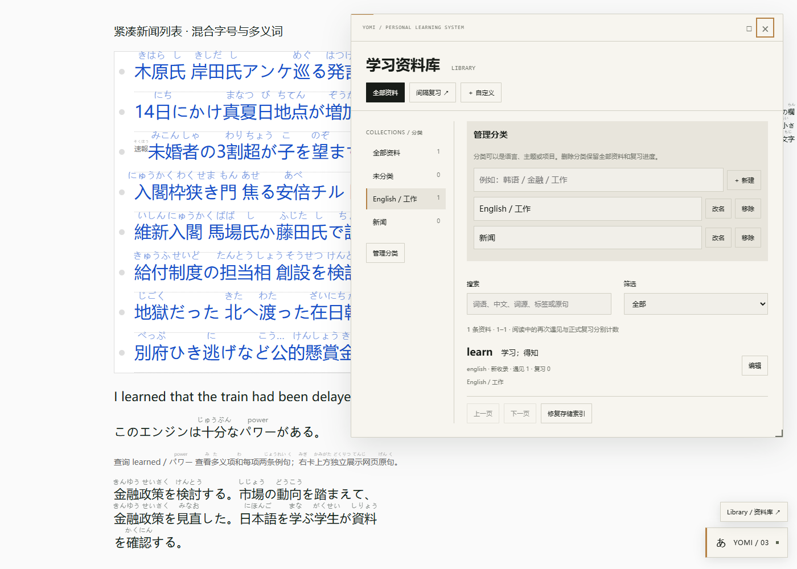

# 3.0.6 · 多分类收录与统一管理

## 交互

- **收录窗口**：主词卡、例句子词卡和自定义项目都打开同一个小窗口。勾选多个分类，显示所选数量，确认后保存；没有选择时归入未分类。已收录词默认勾选现有归属，可修改。Esc 取消本次归属操作。
- **即时新建**：直接输入「韩语」「金融」「工作」等名称，新建后自动勾选。新建分类即时持久化；取消词条收录不会撤销已明确新建的分类。
- **Library 分类栏**：左侧显示全部、未分类、自定义分类和各自数量；右侧沿用搜索、资料类型和学习状态筛选。窄窗口自动改为顶部折行分类导航。
- **统一管理**：管理区支持创建、改名、移除，资料详情也能重新多选归属。系统栏不能删除；自定义分类名称 1–40 字符，同名或系统保留名称有可见错误。
- **共享资料**：多个分类引用同一个 LearningItem，释义、上下文和 SRS 进度只有一份。分类归属变化不增加自然遇见次数，也不重置复习进度。
- **安全移除**：移除分类不删除词条。一个词失去所有有效分类后出现在未分类；仍有其他分类则保留其他归属。

## 数据与兼容

分类目录保存在现有 GM／演示 IndexedDB 存储接口的 `yomi:library:v1:categories`，条目为 `{id,name,createdAt,updatedAt,deletedAt?}`。LearningItem 新增可选 `categoryIds: string[]`，旧资料无需迁移即可作为未分类读取。

分类目录和条目修改复用既有跨页写锁；归属提交前重新检查目录，防止将资料存入另一个页面已删除的分类。删除采用分类记录标记，查询与 UI 忽略已失效归属，不为删除一个分类重写一万个词条。启动读取 64 个资料索引分片和 1 份分类目录；普通 Hover 不逐词查询存储。

其他语言可以通过自定义项目保存和分类。自动识别、注音与词典的语言覆盖仍为原来的日英范围，创建「韩语」分类不等于自动支持韩语网页分析。

## 实测

Microsoft Edge 152，运行当前生产脚本和实际存储接口。`pnpm test:categories` 六组通过，结果见 [results.json](categories/results.json)：

1. 收录时创建两个分类并多选，再次打开显示已选归属；Esc 取消不改归属。
2. 两个分类均显示同一个词，「全部」只有一条；刷新后目录和归属保留。
3. 资料详情修改归属，未复制词条或改变学习数据。
4. 改名保留关联；移除最后一个分类后，词条仍在未分类中。
5. 新建韩语分类并收录 `안녕하세요` 自定义项目。
6. 重名错误局部显示；390px 窄屏、深色主题下没有水平溢出。

34 项单元测试通过，包含分类并发创建、陈旧分类拒绝、旧数据兼容、删除不重写词条、SRS 记录保留。Library／SRS 十组及例句交互六组回归通过；回归中的收录操作已更新为先选分类再确认。

手动验证：启动 `pnpm demo`，在 [复现页](http://127.0.0.1:4173/precision.html) 查询 `learned`，点击收录并新建分类；随后打开 Library 管理。演示库只属于当前本地域名／端口，安装版使用脚本管理器共享资料库。

## 更新

用 [dist/yomi-reader.user.js](../dist/yomi-reader.user.js) 替换已有脚本并保存、刷新网页，版本 **3.0.6**。旧设置、词条与学习进度保留。

新增 `src/collection-picker.js`；修改 `learning.js`、`learning-ui.js`、`main.js`、`ui.js`、`ui-styles.js` 和编译版本。新增 `tests/categories.test.mjs`、`tests/categories-browser.mjs`，更新原有收录回归步骤。
