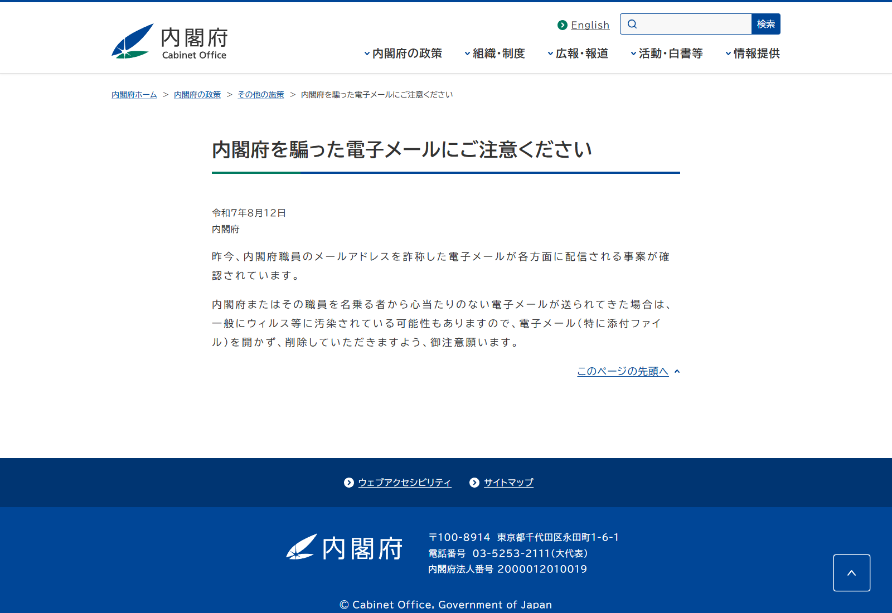
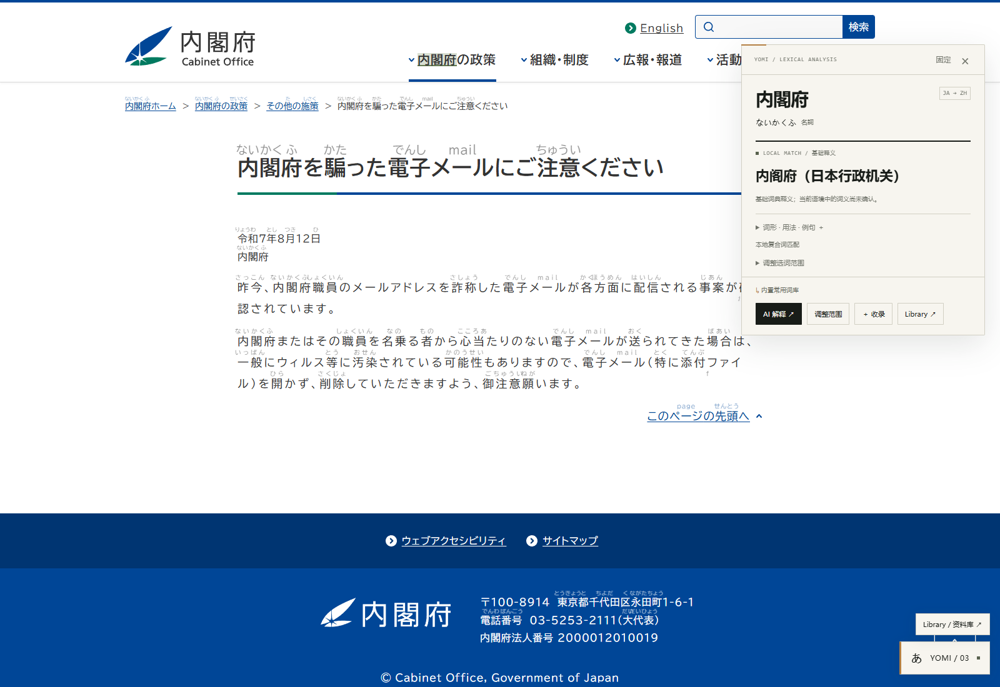
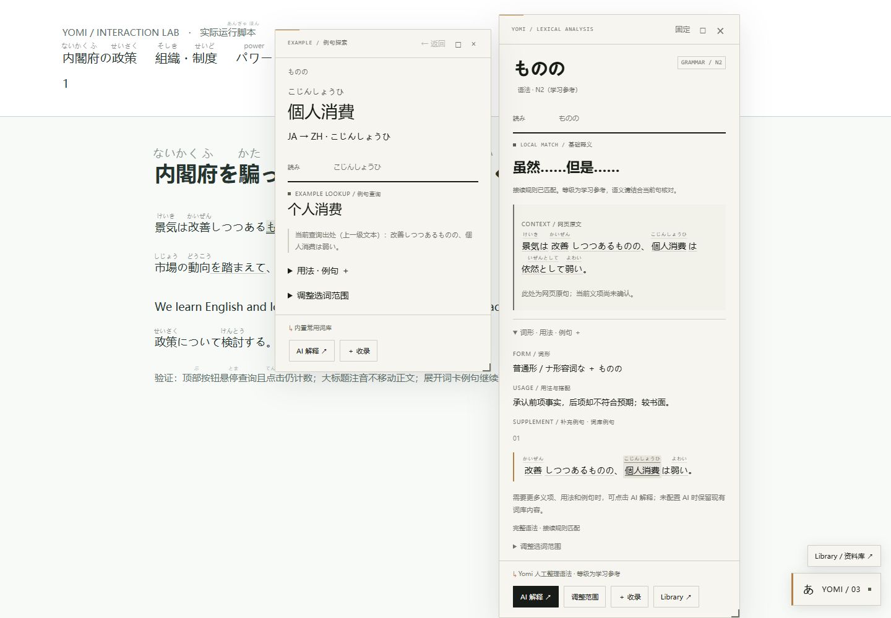
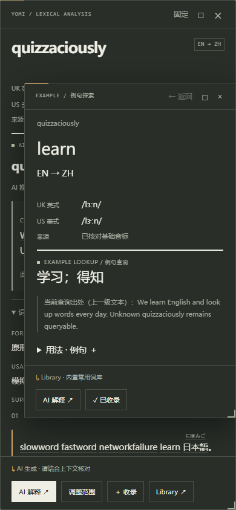

# Yomi 3.0.2：导航查询、拖动与例句子词卡

更新方法：在脚本管理器中用 `dist/yomi-reader.user.js` 全部内容替换原 Yomi 脚本，保存，刷新目标网页。名称、namespace、设置和学习资料存储键不变。不要同时启用两份脚本。源代码、生产安装包与本地演示均已更新。

## 实际原因及修改

在 [内阁府原页面](https://www.cao.go.jp/others/csi/security/20250812notice.html) 的真实 DOM 中确认：

1. 顶部「内閣府の政策」等是原生 `button`，旧 `EXCLUDED` 同时供自动注音和悬浮查询使用，将这些可读文字一起排除了。现在查询允许读取按钮文字，自动注音仍不改写按钮内部 DOM。浏览器 caret API 对 `user-select:none` / 按钮不可靠时，增加基于实际字形矩形的只读回退，每次最多检查 24 个文本节点、600 个字形，不拦截点击。
2. H1 字号 34px，行高约 41.997px，低于旧版 1.5 倍行高门槛。它已可分词，却被一律取消注音。现在有足够上方留白的单行标题可使用绝对定位短注音；紧凑正文和多行紧凑标题仍保守省略注音。没有调大原文行高或重写段落 HTML。
3. 原词卡例句是纯文本，整个 UI 处于独立封闭 Shadow DOM 中，页面查询路径有意排除它。现在由专用例句模块在所属 UI 内调用同一套分词、语法和词形还原，不把所有 UI 放进网页扫描器。
4. 实际点击验收发现，高词卡能遮住右下角设置按钮。现在保留底部操作区，入口采用明确的层级和不换行布局；主卡、子卡、设置与 Library 的堆叠顺序统一。

补充了「内閣府」「政策」「組織」「制度」基础词条。「内閣府」可作为有词典依据的整体候选；没有通过任意拼长字符串提高命中率。

## 使用方式

- 主词卡、例句子词卡：拖动顶部空白栏移动；也可 Tab 聚焦顶部栏，用方向键移动。窗口限制在可视区域并为右下角入口留白。拖动不会自动固定词条；主词卡位置在连续换词时保持，关闭后重新选位。
- 展开主卡的「词形 · 用法 · 例句」，悬停约 220ms 或点击其中的日英词语，打开独立子卡。识别到的语法和复合词使用完整范围，当前例句对象有细线和浅背景提示。
- 主卡保持内容及正文 active 高亮。子卡有自己的来源、用法、例句、AI 解释、调整范围、收录入口；无词条、加载、错误和成功均可见。
- 子卡例句可继续查询；复用一个子窗口，最多保存 12 层历史。「← 返回」回到前一项。Esc 先关闭子卡，下一次关闭主卡。手机采用叠放窗口，关闭子卡即可继续读原卡。
- 例句保持原文本，不在其中添加 ruby。可选择复制，不在选区存在时触发悬浮；可通过 Tab / Enter 查询。
- 收录复用现有 Library 和 SRS，不建第二个词汇本。保存所查询的例句、当前网页标题和 URL，并标注上下文来自词卡例句。查询子卡本身不会被当作正式复习。

## 查询隔离及数据边界

子卡有独立 AbortController 和递增请求编号，关闭、返回和换词会取消旧请求并忽略过时结果。复用 AIClient 的并发、订阅去重、缓存和上下文区分；基本查询优先 Library / 本地词库。子卡 API 返回值仅进入子卡，不调用正文 annotation renderer。

AI 未配置时基本词库可用，点击 AI 解释显示明确提示。开启 AI 后，例句生词仍是按需请求；只有启用「附带附近原文」才附带最多 240 字符上下文，不发送整页。AI 测试使用模拟接口响应，没有读取或调用用户的真实 API 账号。

## 修改文件

| 文件 | 用途 |
| --- | --- |
| `src/text-engine.js` | 按钮查询、字形回退、标题留白检测 |
| `src/main.js` | 注音与按钮查询分离；例句分词、AI 和 Library 适配 |
| `src/lexicon.js` | 常见导航词与机关名称 |
| `src/drag.js` | 标题栏拖动、键盘移动、边界约束 |
| `src/example-explorer.js` | 独立例句子查询、历史、请求取消与收录 |
| `src/ui.js`, `src/ui-styles.js` | 主卡接入、Esc 层级、样式与入口避让 |
| `demo/interactions.html` | 可复现交互页面 |
| `tests/interactions-browser.mjs`, `tests/cabinet-browser.mjs` | 鼠标/键盘验收与真实网站检查 |
| `package.json`, `scripts/build.mjs`, `README.md` | 版本、命令与更新说明 |
| `dist/yomi-reader.user.js`, `demo/yomi-reader.js` | 相同生产构建产物 |

没有更换技术栈、修改参考 UI 项目或改变已有学习数据格式。

## 复现及验证

```sh
pnpm build
pnpm demo
# 打开 http://127.0.0.1:4173/interactions.html
pnpm test
pnpm test:interactions
pnpm test:browser
pnpm test:learning
pnpm test:ai
pnpm test:cabinet  # 需要可访问内阁府网站
```

使用 Edge 152 headless、实际生产 bundle、真实 IPADIC 分词与原生鼠标/键盘事件。封闭 Shadow DOM 仅在测试的初始化钩子中保存引用，生产代码不暴露调试入口。

- 26 项单元测试通过。
- 既有阅读 12 组、Library/SRS 10 组、DeepSeek JSON 兼容 4 组浏览器回归通过。
- 本轮交互验收：按钮查询和点击、标题不位移、主/子卡拖动、日语语法/复合词、英文递归和返回、收录、AI 未配置、网络失败、旧响应取消、混合例句、选区和键盘、80/100/150% CSS 缩放、390px 窄屏、深浅主题、减少动效。详见 [机器结果](interactions/results.json)。CSS 缩放验证不等同于穷举浏览器所有原生缩放组合。
- 原网站实测：顶部按钮能查「内閣府」，原菜单仍可展开；H1 恢复注音；H1、body、导航按钮在注音前后 x/y/width/height 严格相同。[原网页结果](interactions/cabinet-results.json)。

实际运行截图：









`cabinet-before.png` 是原网站未注入脚本的基线，不是旧版脚本截图；用户提供的旧版截图是本次问题线索。

## 限制与覆盖边界

查询入口覆盖与词典命中分开：已验证该站原生导航按钮、标题、普通文本及词卡例句可打开查询；不代表基础词典收录所有词，也不代表分词和语法分析始终正确。生词保留 AI / 调整范围入口。

顶部「内閣府 Cabinet Office」标志本身是图片，未增加 OCR。图片、canvas、不可访问框架和其他网站封闭 Shadow DOM 的限制仍在。输入区、编辑器、代码等保持排除。按钮只支持只读查询，不加正文注音；既有网站菜单如果主动覆盖文字区域，可能需要重新定位鼠标或划词。

标题留白规则是保守几何判断；复杂跨栏、裁切或动态字体可能仍不显示注音。例句字段按日英学习内容解析，纯汉字默认提供日语候选；若服务把中文译文错误地放进例句字段，仍需人工核对。子卡不进行自动语义纠错。没有保证所有词都能正确识别。
