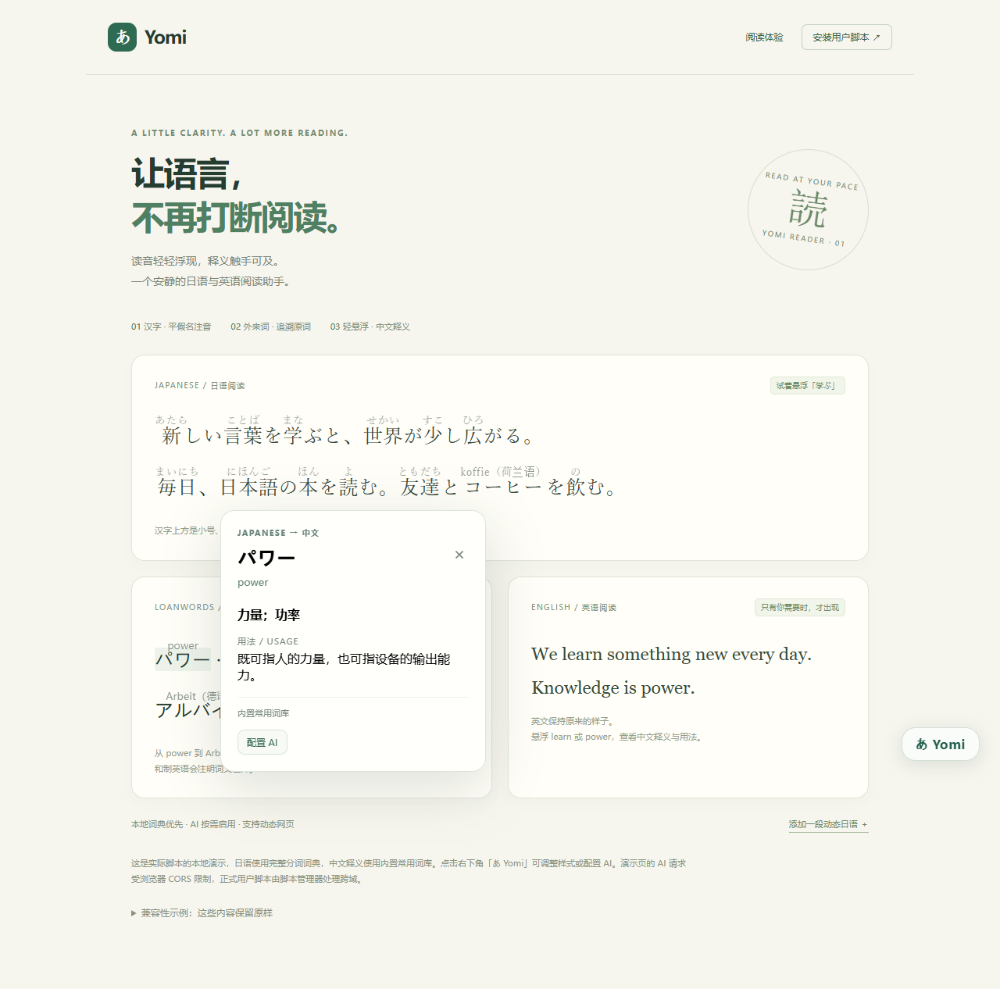
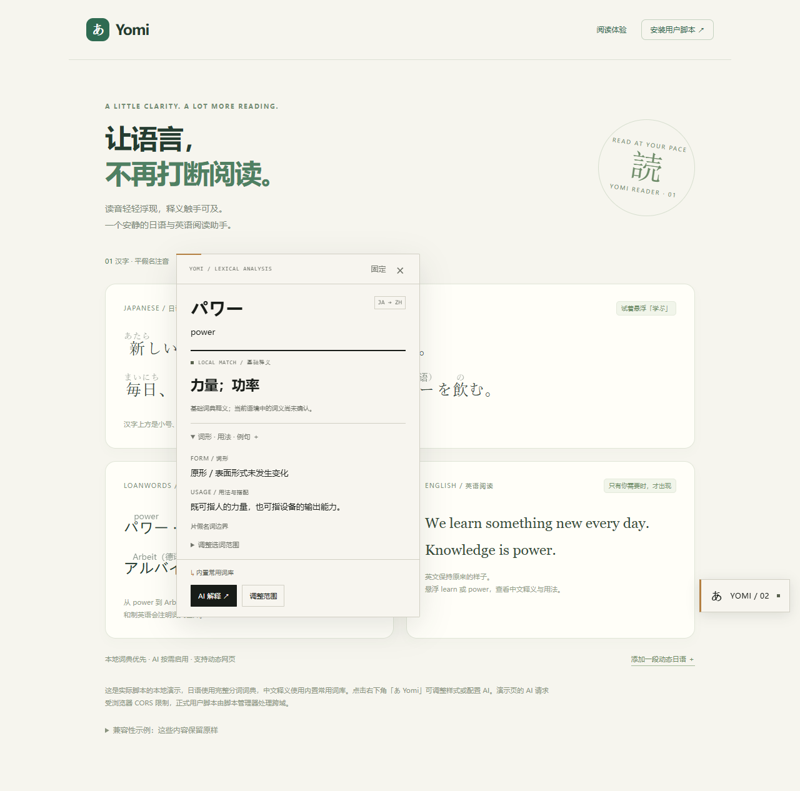
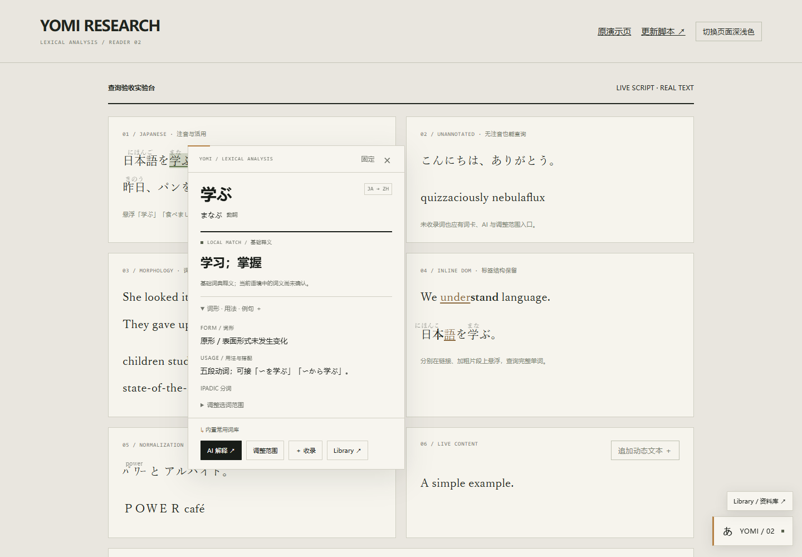
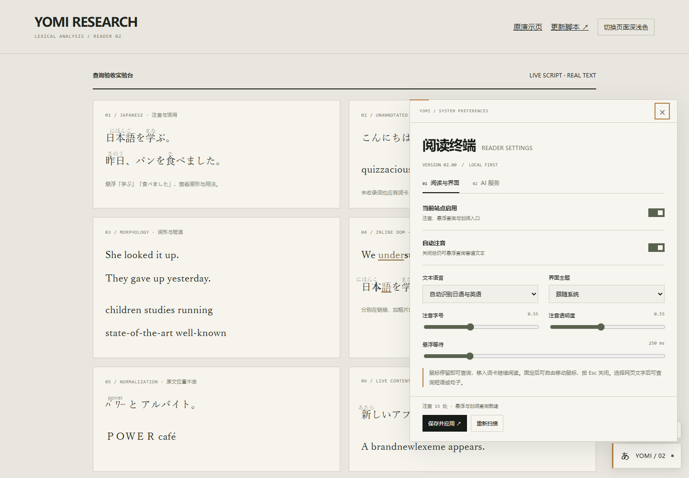
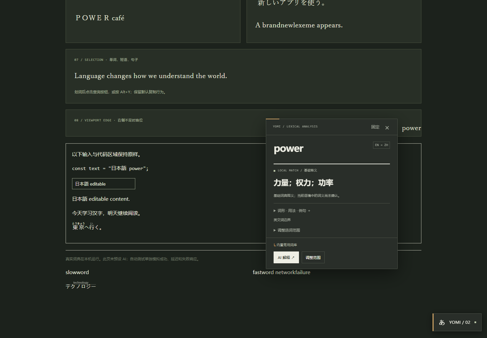
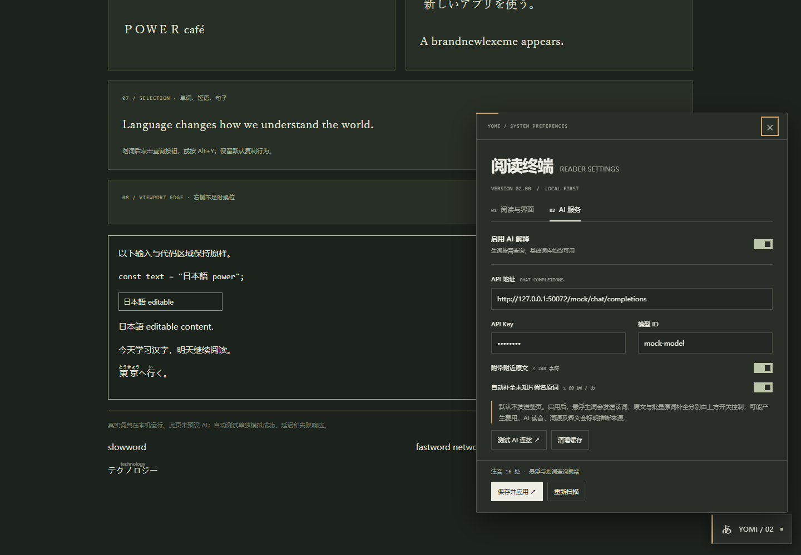

# Yomi 02 · 第二轮迭代与验收报告

已直接修改现有项目并生成 `dist/yomi-reader.user.js`（2.0.0）。原有日语词典、常用释义、AI 协议、词典缓存、站点偏好继续使用；新增查询能力不依赖是否生成注音。

## 参考来源与视觉实现

本次尝试访问 Bilibili 链接时未能读取视频，未观看视频，也不声称提炼了视频中的具体镜头或逐帧动效。

实际参考是用户提供的 `RhineLabUI-main`：

- `DESIGN.md` 中的暖灰白背景、黑色文字、暖杏金信号、紧凑中英文字阶与细分隔线。
- `src/style.css` 的颜色与字体后备设置。
- `docs/media/detail.jpg`、`docs/media/settings.jpg` 的实际界面截图。

参考目录保持原样。阅读脚本没有引入 Three.js、音效或开机动画。词卡采用内容优先的 180ms 轻微淡入/位移，展开内容约 150ms，开关约 130ms；系统要求减少动态效果时关闭这些效果。它们是本次阅读界面的适配选择，并非对未观看视频的测量结论。

词卡由目标词/读音/原形、语言与词性标记、突出中文释义、按需展开的次级内容、底部来源与操作组成。设置改为阅读/AI 两个面板，使用方形开关、细线刻度、明确数值和持续可见的保存区域。加载、无结果、错误和成功均有文字和视觉状态。

## 实际漏词原因及对应修复

| 检查项 | 1.0 实现中的实际原因 | 2.0 修复 |
| --- | --- | --- |
| 查询绑定 | `pointerover` 仅接受 `[data-yomi-token]`，且要求 `meta.has(element)`；未包装的 Text 节点直接返回 | 独立委托 `pointermove/pointerover`，使用浏览器 caret API 和字形矩形从普通 Text 节点定位；划词作为最终补救 |
| 纯假名 | 日语扫描仅给汉字、长度大于 1 的片假名生成包装；纯假名没有查询目标 | 浏览器/词典分词均可给纯假名提供候选，是否生成 ruby 与查询无关 |
| 词典加载失败 | 旧版 `tokenizerFailed` 导致后续日文片段跳过，叠加元素绑定后查询也消失 | 卡片先显示已有候选；完整分析超时或失败时使用浏览器分词；网络错误不关闭本地入口 |
| 跨标签单词 | `processText` 以每个 Text 节点单独匹配，`under` 与 `stand`、日/本/語被分别处理 | 构造有界只读文本窗口及 DOM 偏移表；分析完整词，分别标注局部 Text，保留 `<a>`/`<strong>` 原元素及事件 |
| 正规化与字符范围 | 旧英文正则以 A–Z 为主；片假名正规化只用于部分匹配 | Latin 字符范围、连字符/撇号支持；按 grapheme 记录 NFKC 到原文的起止映射，半角假名/全角英文原文不改写 |
| 词形与多词表达 | 旧版只有少数英文后缀/不规则词形，无短语动词识别；日语表层形与助动词分开 | 日语动词/形容词与有界助动词序列合并；扩充词形候选；只允许已收录的多词表达优先，保留单词候选 |
| 上下文定位 | 旧 `contextFor` 用 `text.indexOf(word)`，重复词可能取到第一次出现的位置 | 以鼠标所指的原文偏移截取最多 240 字符，而非按词面查第一次出现 |
| 无词条补救 | 旧版只有词库未收录提示及 AI 设置入口，不能更改查询词或划词 | 所有候选均有词卡；新增调整范围、手动文本、候选切换、划词按钮、Alt+Y 与菜单查询 |
| 异步结果 | 原版已有 hoverID 防护，但查询状态局限于标注元素 | 统一请求序号覆盖原文悬浮、候选切换、手动范围、设置变更；过时响应忽略，不覆盖新词 |
| AI 词源来源 | 原版自动补全将原词直接写入 rt，缺少可见的推断区分 | AI 原词使用虚线及标题标记，词卡注明 AI 词源/读音/释义推断 |
| 页面 CSS 缩放 | 本轮测试发现，根元素 zoom 会把浮层坐标再次放大 | 浮层中抵消根元素的 CSS zoom，按可视视口约束位置；真实浏览器的默认 CSS 像素缩放不被该抵消机制覆盖 |

关键实现：[`text-engine.js`](../src/text-engine.js)、[`main.js`](../src/main.js)、[`ui.js`](../src/ui.js)、[`ui-styles.js`](../src/ui-styles.js)。

## 查询流程及有界约束

1. 复用已有分词缓存或已加载词典结果；英文无需下载词典。
2. 从指针的 Text 节点和字符偏移构建局部窗口，排除 ruby 读音、输入/编辑区、代码、隐藏内容和脚本 UI。
3. 提取候选并立即打开词卡。日语完整词典尚未加载时最多等待约 1 秒再落到候选结果，后台词典加载可以继续。
4. 日语仅合并有语法依据的活用尾部；复合词调整以本地词库为依据。英文只对已收录的表达提高优先级，可分离短语动词最多跨 2 个受限宾语词。
5. 无结果仍保留 AI、调整范围与划词入口。不会为提高命中率无限扩张文本或机械地选最长词串。
6. 基础词条缓存最多 500 项；语境 AI 缓存按语言、词面、原形、上下文及服务配置区分，最多 200 项。失败不写入成功缓存。

鼠标分析合并到动画帧，悬浮等待可调为 150–700ms。注音由增量 MutationObserver 驱动，自身包装和 rt 被排除；每批处理让出执行时间。有活动选区时延后涉及的注音，不主动改写正在选择的文字。复制中剔除脚本注音，并保留原始正文与 HTML 信息。

## 可复现的实际验证

执行：

```sh
pnpm build
pnpm test
pnpm test:browser
node scripts/capture-demo.mjs
```

本轮 **11 项单元/真实词典测试通过**。浏览器测试使用 **Microsoft Edge 152.0.4191.66 无头模式**，**12 组验收通过，未出现未捕获页面异常**。运行时间和完整分组见 [`results.json`](results.json)。

| 验收项 | 实际测试 | 结果 |
| --- | --- | --- |
| 已标注词可查 | 学ぶ → 学习；掌握 | 通过 |
| 未标注词可查 | こんにちは；关闭自动注音后查询学ぶ、英文生词 | 通过 |
| 未收录词补救 | quizzaciously / nebulaflux 显示未命中、AI、调整范围 | 通过 |
| 词形与表达 | 食べました → 食べる；children；studies；looked it up；gave up；well‑known | 通过 |
| 行内标签拆词 | under + stand；日 + 本 + 語；链接节点和 click 监听继续有效 | 通过 |
| 动态内容 | 插入日语段落；直接更改英文 Text 节点；检查重复包装和循环 | 通过 |
| 快速切词 | slowword 请求延迟 1600ms，切到 fastword 后等待旧响应返回 | 旧响应不覆盖新词 |
| 四种状态 | 本地成功、未找到、异步等待、模拟网络失败 | 均可见 |
| 主题与边缘 | 浅/深色页面与浮层，右侧单词，390×844 窄屏 | 通过 |
| 缩放 | documentElement CSS zoom 80%、100%、125%、175% | 卡片边界在视口内 |
| AI 未配置 | 点 AI 入口有明确配置提示，本地词仍可查询 | 通过 |
| AI 网络失败 | 模拟网络中断，随后查询本地 power | 错误可见，本地查询正常 |
| 注音分析失败 | 阻止真实词典下载，再查询纯假名、学ぶ和英文生词 | 查询入口仍可用 |
| 固定/选区/复制 | 固定后移动鼠标；Esc；整句 Alt+Y；复制日语原文 | 通过 |
| AI 标注及渲染 | 自动补全 technology；AI 输出中的 HTML 作为纯文本显示 | 通过 |

**测试范围说明：**真实 IPADIC 参与了分析；AI HTTP 成功、延迟和失败由 Playwright 拦截模拟，并非真实模型账户的质量测试。没有安装或操作用户的 Tampermonkey 实例，也没有验证 Firefox/Safari、所有网站、浏览器工具栏缩放或真实移动设备。CSS 布局缩放不等同于工具栏缩放，本报告不混用这两个结论。

实时手工验收页为 [`demo/verification.html`](../demo/verification.html)，启动服务后访问 [验收实验台](http://127.0.0.1:4173/verification.html)。该页面加载生产编译脚本和真实词典，所有词卡都是运行产生的 DOM。

## 实际截图

可在 [浏览器对比页](http://127.0.0.1:4173/compare.html) 并排查看。1.0 截图来自上一轮实际运行；同页新版截图重新在 1280×1000 视口运行获取。

| 改版前 | 相同页面改版后 |
| --- | --- |
|  |  |

| 新版词卡 | 新版设置 |
| --- | --- |
|  |  |
|  |  |

其他截图：[未配置 AI](after-unconfigured.png)、[加载中](after-loading.png)、[网络失败](after-network-error.png)、[模拟 AI 成功](after-ai.png)、[窄屏设置](after-settings-mobile.png)、[旧版窄屏设置](before-settings-mobile.png)。截图未经过视觉改绘。

## 仍存在的限制：不作“所有词都正确识别”的声明

- **入口覆盖**：已验证普通 Text 节点、跨行内标签、已有 ruby、动态内容和选区补救；图片、Canvas、PDF/特殊阅读器、iframe、网页 Shadow DOM、输入/编辑区及代码不处理。没有指针 caret API 的环境依赖划词入口。
- **词典命中**：中文词库仍是起始常用词库。未收录词可以查询但不一定有本地释义；补充词典或 AI 才能增加释义覆盖。
- **分析准确性**：IPADIC、浏览器分词和启发式词形还原都可能出错。未知专名、复杂复合词、多义词、少见活用、分离宾语更复杂的短语动词需要人工调整；只有已知表达会自动提高优先级。
- **汉字判别**：无日语线索的纯汉字段落与中文不可仅凭字形可靠区分，需要日语模式或用户划词。
- **标注排版**：跨标签的一个读音组只在首片段标读音。网页自行裁切行高时无法保证注音可见；可关闭注音保留查询。复杂框架重写 Text 或标签也可能移除标注。
- **性能与结构**：有界窗口不会跨块级段落合词；极长文本节点不自动注音，但仍可按鼠标局部查询。未给出未经测量的“所有大网页流畅”承诺。
- **模型与网络**：AI 可能提供错误词源、读音或语境解释；所有 AI 推断均有来源提示。用户需自行配置可用服务，真实账户兼容性仍取决于该服务的协议实现。
