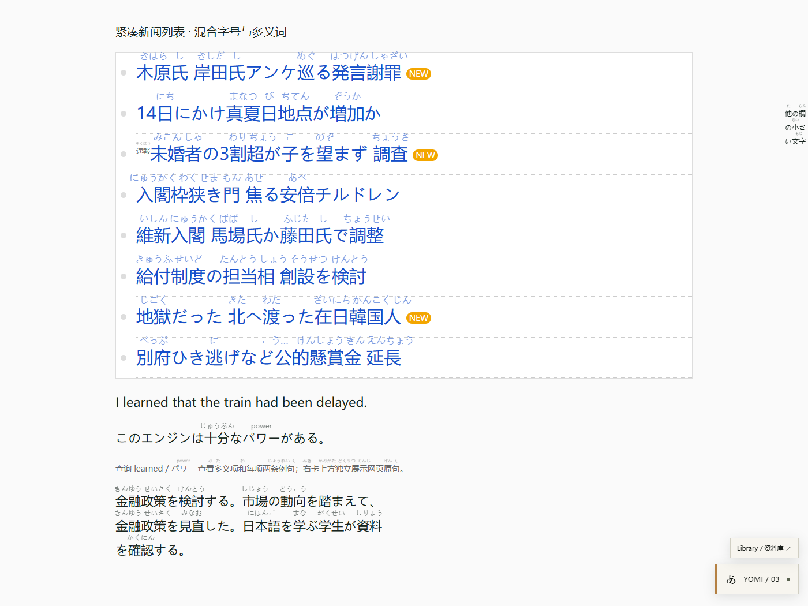
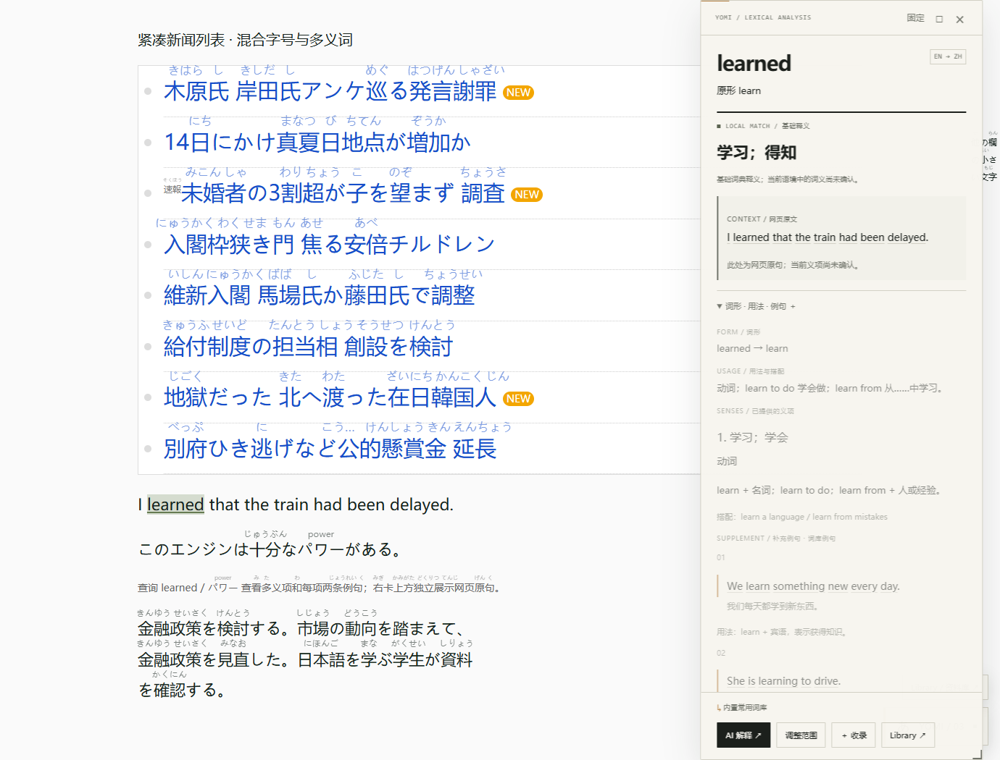
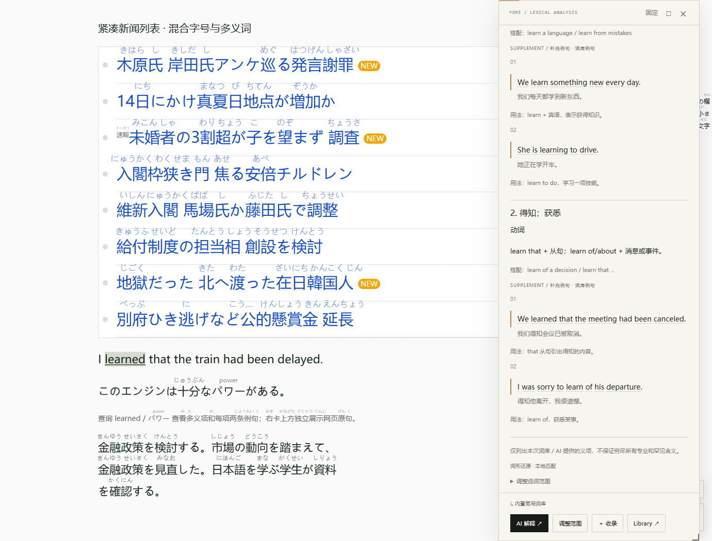

# 3.0.5 · 紧凑排版与多义项资料

## 根因与修复

3.0.4 的前行检测扫描了其他文字块，并用约 3px 的顶部差来判断“前一行”。混合字号、上标或邻近栏目的文字会被误判，随后的刷新又按当前值追加行距与顶部留白。四次循环限制仍允许产生过大的空隙。另一个问题是逐词按可用宽度缩小注音字体，同字号原文上出现了不同字号的注音。

3.0.5 只检查同一格式块的原文字形，以足够的纵向距离排除同一行的混合字号，不再使用前面其他块的文字制造顶部补白。局部行距保留修改前基准，最多增加一份注音高度及 3 CSS px；多次观察器回调与重排不能无限累加。原行距足够的单行列表无需增高。

注音统一按原文字号乘设置比例，不再逐词缩小。横向布局使用附近可用空白，限制移动距离并避让相邻注音，不改变原文宽度。少数空间不足的长读音以省略号结尾，词卡保留完整读音。若特殊布局在有限补偿后仍无法安全显示，允许局部隐藏注音；查询入口不受影响。与原文同一 DOM 滚动子树的锚点保持不变，仍由浏览器同步滚动。

## 资料卡

- 网页原句独立放在 **CONTEXT / 网页原文**，不会与补充例句混排。
- `contextMeaning` 单独保存本次语境判断；没有发送上下文时，客户端清除模型的语境确认字段。
- `senses[]` 逐项保留 `meaning / pos / usage / collocations / contextMatch / examples[]`；例句包含 `text / translation / usage`。
- AI 提示要求按独立常见义项分别说明，并尽量每项提供至少两条自然例句，不能复制网页原句充数，也不能编造未知义项。接口保留 DeepSeek 非思考 JSON 适配，输出预算改为 3200 tokens，一次失败重试上限仍为 4096。
- 本地 `learn` 和 `パワー` 已补入人工撰写的分义项资料，每项两条例句。其余旧条目继续展示已有释义要点、通用用法和例句；不把分号两边的近义词擅自认定为不同义项。
- 主卡与例句子卡使用相同资料渲染器；各义项下的例句仍支持嵌套查询。
- 收录保留义项与多例句。再次遇见不沿用旧语境的 `contextMatch` 标记。兼容旧数据，不清空资料库。

这里只展示词库或模型实际提供的内容，不能保证所有词的所有专业、罕见含义都已列全。AI 未配置时仍使用已有基础内容，不自动编造第二条例句。

## 验证与截图

使用实际生产脚本、IPADIC 与 Microsoft Edge 152。复现页按用户截图中的新闻列表、混合字号及侧栏文字构造，未宣称已经在线验证用户截图所在原网站。AI 响应由测试模拟，没有使用用户付费账户。

`pnpm test:precision` 六组通过，记录见 [results.json](precision/results.json)：

1. 八条新闻高度与注入前完全一致；30px 链接文字上的注音均为 16.5px，无额外顶部 padding。
2. 横向借用空白后，复现列表超过 90% 的读音完整显示，注音矩形之间没有碰撞。
3. 多次 DOM 属性变化、窗口重排没有累加行距。
4. 原文与两义项、每项两例句分离；基础词典不伪称已确认语境。
5. 第二个义项下的例句可打开子词卡。
6. 模拟结构化 AI 响应显示独立语境解释、对应义项标记和多个例句。

其他检查：30 项单元测试通过；多行／同步滚动六组、基础浏览器十二组、例句交互六组、DeepSeek 响应四组回归通过。收录多义项刷新持久化、清除旧语境标记有专门单元测试。

## 复现与安装

启动 `pnpm demo`，打开 [precision.html](http://127.0.0.1:4173/precision.html)，查询 `learned` 或 `パワー`，展开用法例句，再查询第二义项的例句词语。缩放／滚动测试另见 [scrolling.html](http://127.0.0.1:4173/scrolling.html)。

安装版为 [dist/yomi-reader.user.js](../dist/yomi-reader.user.js)，版本 **3.0.5**。在 Tampermonkey 编辑已有脚本，全部替换，保存并刷新网页；这也会清除旧版已经施加在当前页面上的间距。原有设置与学习资料继续保留。

主要修改：`annotation-overlay.js`、`core.js`、`network.js`、`ui.js`、`ui-styles.js`、`example-explorer.js`、`learning.js`、`main.js`、`lexicon.js`。新增共享渲染 `knowledge-view.js`、复现页 `demo/precision.html`、`tests/precision-browser.mjs` 与 `tests/senses.test.mjs`。编译产物同步更新到 dist 和 demo。
