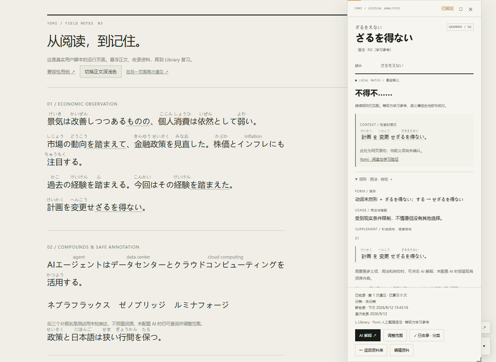
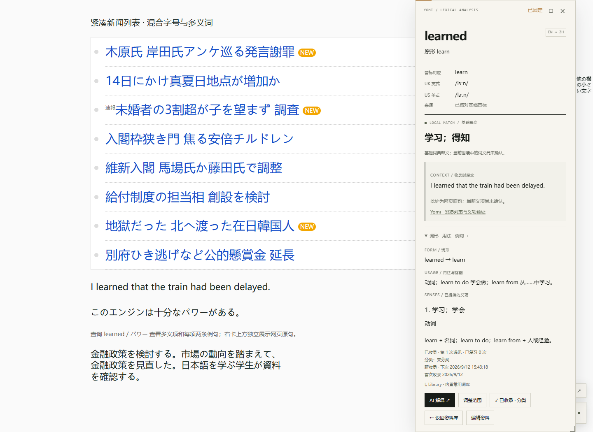

# 3.0.7 · 收藏回看与卡片发音

## 原因与修改

原先 Library 条目按钮直接进入编辑表单，没有连接已存在的完整词卡。收录结构主要保存原形，没有保留查询时的活用形式；AI 协议、存储与卡片也缺少独立的英式／美式音标字段。例句虽然能继续查询，但没有渲染假名。

- 点击收藏条目恢复完整词卡，默认固定并展开用法／例句。保留收录时的查询形式、原句和网页来源；列表另设「编辑」按钮。返回后保留分类、搜索或当前复习题。
- 保存可选 `cardInfo`（查询形式、原形、读音、语言、类型、语法 ID、词性）、`language`、`ipaUk`、`ipaUs`、`pronunciationWord`、`pronunciationSource`、`readingSource`、`contextMeaning` 等字段，复用原数据库。旧资料缺少查询形式时回退到原形，不伪造历史表层文本。
- 主词卡与子词卡显示假名或独立 UK／US 音标。日语词头上方标注读音；卡内原句和补充例句的汉字词也标注假名。注音使用 CSS 伪元素，原句的文本节点内容、选择和复制不混入读音，不改变网页正文布局。
- 例句渲染先保留完整语法范围，再处理前方动词；避免「せざる」等活用合并吞掉「ざるを得ない」的开头。完整语法可整体点击查询、注音与高亮。
- 回看不计为自然遇见或正式复习。揭晓复习答案后显示发音与「查看完整资料卡」，返回后继续原题，只有四级评分才提交复习记录。
- AI 请求明确要求查询词本身的两种 IPA，不确定留空。收藏卡中的 AI 查询使用保存时原句（仅开启发送上下文时）；点「保存本次补充」持久化新解释和音标。修改查询范围后解除原词条保存关联，避免误覆盖。
- 编辑界面支持手动修正假名／双音标，并标记用户编辑。保存知识不会重置分类、自然遇见或复习记录。

## 实际运行截图

截图来自 Edge 运行编译后的用户脚本与真实 IPADIC，不是静态设计稿。

## 实际验证

2026-09-12，Microsoft Edge 152，无头浏览器，生产编译脚本、真实日语词典与演示 IndexedDB；AI 返回由测试拦截模拟，没有调用用户的真实账户。

- `node --test tests/*.test.mjs`：37/37 通过，覆盖存储兼容、IPA 校验、原形音标标识、知识更新与学习计数隔离。
- `node tests/saved-cards-browser.mjs`：7 组通过，结果见 [results.json](saved-cards/results.json)。实际验证收藏语法／词汇回卡、原句与读音、独立编辑、刷新后双音标、例句子卡、复习返回、手动编辑、AI 补充保存与改选词不覆盖旧条目。
- 同轮已有分类测试 6 组、阅读／收录／复习回归 10 组通过，分别见 [分类结果](categories/results.json) 和 [学习结果](iteration-3/results.json)。例句交互回归见 [交互结果](interactions/results.json)。

手动复现：运行 `node scripts/serve.mjs`，打开 `/learning.html`，收录「踏まえる」「ざるを得ない」，再从 Library 点击条目；确认完整卡片、原句、假名及返回路径。打开 `/precision.html`，收录 `learned`，刷新后进入 Library，确认卡片仍是 `learned`，基础音标明确对应 `learn`。编辑音标并保存后重开；或配置 AI，补充后点击保存并刷新。最后在复习中显示答案、进入完整卡片再返回，确认题目和进度保留。

## 发音来源和限制

- 本地双音标起始集仅 `learn`、`policy`、`power`，分别依据 Cambridge 的 [learn](https://dictionary.cambridge.org/us/pronunciation/english/learn)、[policy](https://dictionary.cambridge.org/pronunciation/english/policy)、[power](https://dictionary.cambridge.org/us/pronunciation/english/power) 发音页核对。它不是完整发音词典。
- 其他英语单词使用已保存／用户填写／AI 返回的 IPA；未知或缺少某一方言时明确显示未收录。仅有原形音标时不会把它冒充为活用形式的发音。AI 生成的发音标为推断，仍需核对；格式校验不等于语言学准确性验证。
- 日语使用保存读音或 IPADIC；陌生专名、多音词可能错误或缺失，允许编辑。很长的查询文本不强塞整句注音，安全读音长度仍受限。卡内英文例词通过悬停／点击子卡查看双音标，不在每个英文词上方堆叠 IPA。
- 历史词条若没有保存原查询形式或具体语境释义，无法追溯重建；打开已有资料，缺失字段明确回退。音标补充只按用户操作触发，不自动向 AI 发送全部收藏或整页。

## 更新与文件

用 `dist/yomi-reader.user.js` 全文替换现有 Tampermonkey 脚本，保存、刷新，版本为 **3.0.7**；不要新建并同时启用第二份。存储键保持不变。演示脚本同步更新；尚未代用户修改浏览器中的已安装脚本。

新增 `src/pronunciation.js`、`tests/pronunciation.test.mjs`、`tests/saved-cards-browser.mjs`；修改 `src/main.js`、`src/core.js`、`src/network.js`、`src/learning.js`、`src/learning-ui.js`、`src/ui.js`、`src/ui-styles.js`、`src/example-explorer.js`；同步版本、编译产物、README 与既有测试选择器。下一步可接入有授权的完整英语发音词典，扩大离线覆盖。
