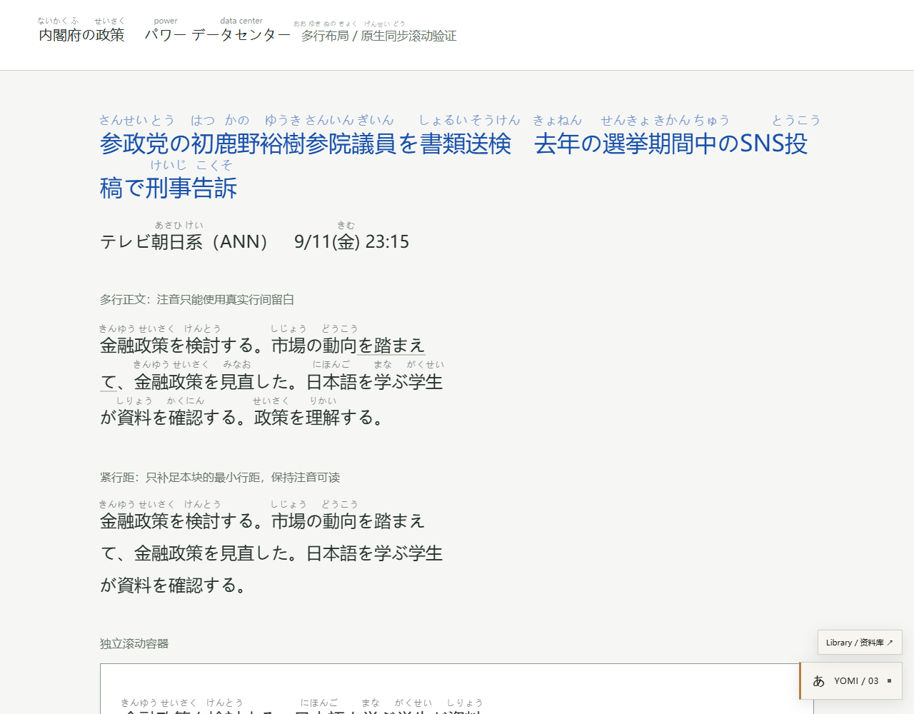
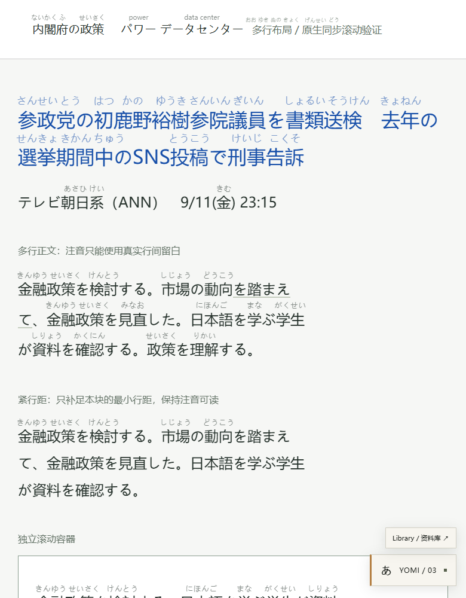

# 3.0.4 · 多行注音与滚动同步

历史报告：3.0.4 的避让范围和间距累加后来暴露问题，已由 [3.0.5 修正](PRECISION.md) 替代；当前版本不再跨文字块增加顶部留白。

本次按用户选择处理紧行距：只给放不下可读注音的文字块补足最小间距，允许该块高度略增，保持注音持续可见。

## 原因与修复

旧版导航／紧凑文字注音位于固定的视口浮层，滚动事件触发下一帧重新测量。浏览器已经移动正文时，浮层可能还留在上一帧位置，产生跟随延迟。另外，跨行文字使用整体包围盒定位，未检查上一行真实字形占用空间，因而发生重叠。

现在普通 ruby 和紧凑文字统一使用原文旁的零尺寸行内锚点，注音绝对定位在锚点内，由浏览器随同原文滚动、裁切，无滚动事件定位或逐帧追赶。保留原 Text 节点、链接、按钮及其事件，不重写整段 HTML；正文中会增加脚本自己的不可交互锚点。

使用 Range 的各行矩形定位并检查附近原文字形。空间不足时仅增加相应块的必要行距；上方相邻块造成冲突时补少量顶部留白。跨行的同一个词只在较宽的片段上显示一次完整读音，不猜测每个字的读音。字号、透明度仍受设置控制，长释义不会进入正文。

缩窄窗口、字体加载和动态排版变化会重新计算；关闭注音恢复脚本添加的间距，并保留网站随后自行修改的行距。

## 实际验证

运行环境：Microsoft Edge 152 无头浏览器，真实生产编译脚本与本地 IPADIC。复现页使用用户截图中的新闻标题及多行／滚动容器场景，**不是对 Yahoo 原网页的在线验证**。

`node tests/scrolling-browser.mjs` 的 6 组检查全部通过，结果见 [results.json](scrolling/results.json)：

- 拥挤标题与段落增加局部行距；宽度保持不变，原本留白足够的段落高度保持不变。可见注音不与原文字形矩形相交。
- 整页连续滚动到多个位置，在同一 JavaScript 调用内立刻测量，原文与注音的相对偏移变化小于 1px；不等待 scroll 回调或动画帧。
- 内嵌容器连续滚动，同样保持相对偏移。
- 视口从 1280px 缩至 780px，重新换行后无注音与原文字形重叠。
- 125% CSS 布局缩放、动态修改行距后，重新计算安全位置。该验证不等同于全部浏览器工具栏缩放组合。
- 关闭注音后移除锚点、恢复脚本间距，保留网站后续写入的行距。

回归检查：26 项单元测试、12 组基础浏览器检查、6 组导航／例句子查询检查通过。窗口操作 5 组与 Library／SRS 10 组检查也通过；后两套运行在最后一处间距恢复修正前，该修正由专门的关闭注音检查覆盖。

真实运行截图：

## 手动复现与更新

执行 `pnpm demo`，打开 [多行滚动验收页](http://127.0.0.1:4173/scrolling.html)。观察标题第二行和紧凑段落，滚动整页及内部滚动区域，缩窄窗口，再在设置中关闭／开启自动注音。

将 [dist/yomi-reader.user.js](../dist/yomi-reader.user.js) 全部替换到已有 Tampermonkey 脚本，保存并刷新网页，版本为 **3.0.4**。演示页与安装包使用同一编译结果。此次未直接修改用户浏览器中已安装的脚本。

## 边界

行距补足针对普通横排网页文本。固定高度且裁切、特殊 transform、复杂竖排、网站反复覆盖样式的组件仍可能限制注音。此次修复改善渲染与同步，不改变专名识别、词典覆盖或不确定词源的准确率；未知或不可靠读音仍不编造。
