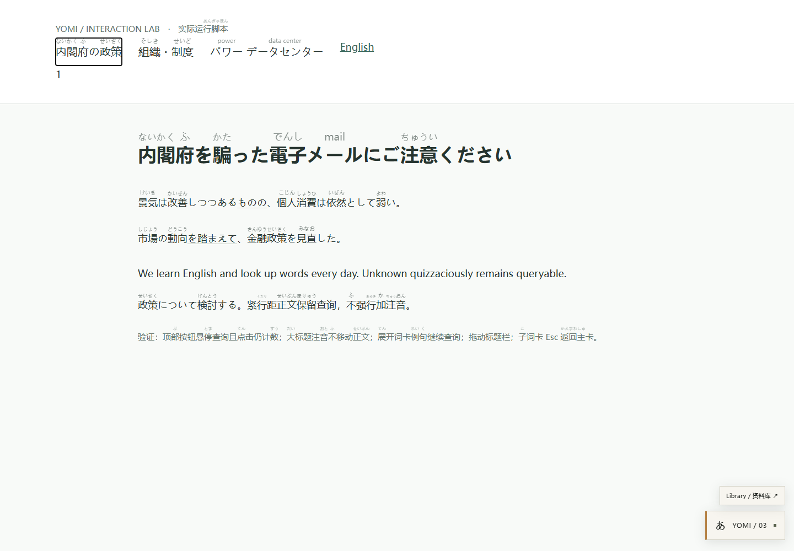
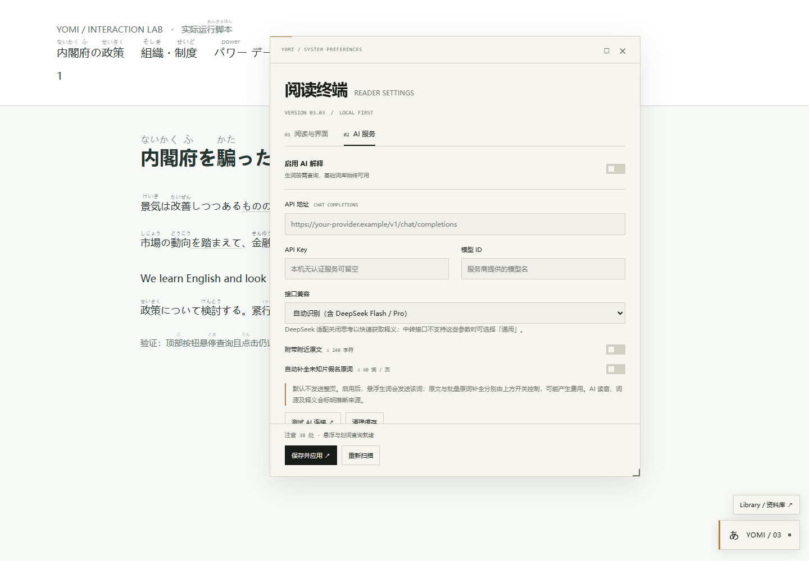
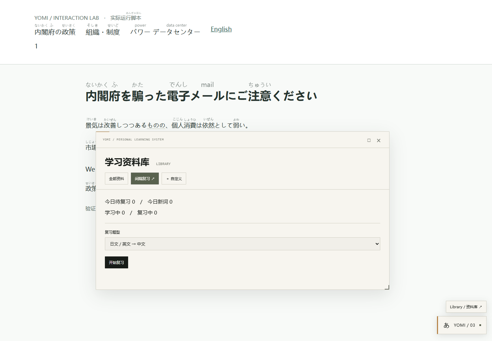
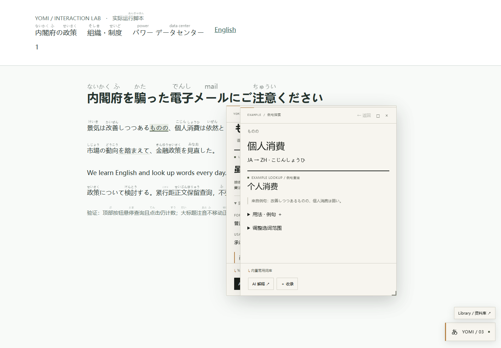
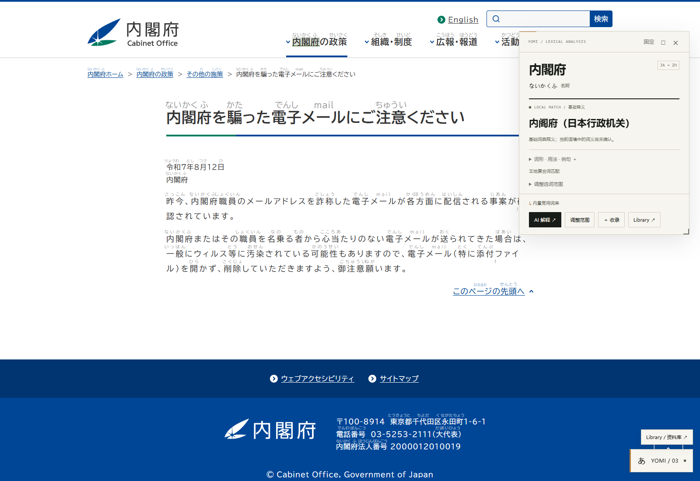

# Yomi 3.0.3：补齐标注与完整窗口操作

本次纠正 3.0.2 的两处交付缺口：**能查询不等于已注音；词卡能拖动不等于阅读终端能作为窗口操作。** 此文取代旧交互报告中「按钮不加注音」和「保留底部操作禁区」的描述。

## 标注现在怎样显示

导航按钮此前仍被 `skipAnnotation` 排除；紧凑文字又被 `suppressAnnotation` 取消读音。这次加入 `annotation-overlay.js`，让按钮和紧凑区域的短假名、可靠短词源在独立绘制层显示，原按钮不插入 span / ruby，不改变 HTML、行高、宽度或点击目标。

已在实际运行中验证：

- 「内閣府の政策」「組織・制度」上方显示对应假名；无需先 Hover。
- 「パワー」「データセンター」上方显示 `power`、`data center`。
- 标注沿原文字形定位；页面滚动、布局变化和字体加载后更新。文字移除或隐藏后，相应标注清理／隐藏。
- 读音／原词仍经过既有严格短文本校验，长定义不进入标注层；未知、不可靠词源不会被编造。AI 返回可信短原词后也可更新此层。
- 原文 DOM 与矩形尺寸保持，默认字体大小和透明度仍由原设置控制；短词位置不足时缩小标签以完整呈现。

普通有足够行距的正文继续复用原 ruby renderer。图片 Logo 没有 OCR；未收录或没有可靠读音的词仍可能没有标注，查询入口继续存在。

## 四类面板统一为可操作窗口

| 窗口 | 拖动 | 调整大小 | 最大化／还原 |
| --- | --- | --- | --- |
| 阅读终端／设置 | 顶栏或「阅读终端」大标题 | 四边和四角 | □ 按钮或双击顶栏 |
| Library／间隔复习 | 顶栏或资料库大标题 | 四边和四角 | 同上 |
| 主词卡 | 顶栏 | 四边和四角 | 同上 |
| 例句子词卡 | 顶栏 | 四边和四角 | 同上 |

移除了 124px 底部禁区，可以贴到浏览器视口四边。窗口不能离开网页所在的浏览器视口。最小尺寸按面板的标题和必要操作栏设置，小屏按实际视口收缩。右下角有可见调整手柄，其他边缘悬浮出现对应方向光标。内容区域随窗口大小滚动。

位置与尺寸在当前页面内保持，不会被 ResizeObserver、换词、切换 AI 设置、Library／Review 标签或关闭重开覆盖。最大化后再点击还原可恢复之前尺寸。浏览器视口缩小时自动约束到新的可见范围；刷新网页后回到默认窗口尺寸。

各窗口在点击时置前。此版本不会为了给右下角入口让位而限制用户移动；可以移动或关闭覆盖入口的窗口。原文选词高亮和父子词卡关系保留，正文没有因窗口拖动或调整大小发生重排。

## 修改文件

- `src/annotation-overlay.js`：新增只读短标注绘制层。
- `src/main.js`：导航／紧凑文字接入标注；已查询可信原词同步至该层。
- `src/drag.js`：共享窗口操作、八向调整、最大化／还原、视口约束及页面会话几何状态。
- `src/ui.js`, `src/example-explorer.js`, `src/learning-ui.js`, `src/ui-styles.js`：全部面板接入，去掉自动定位对手动位置的覆盖。
- `demo/interactions.html`：加入导航外来词测试。
- `tests/windows-browser.mjs`, `tests/cabinet-browser.mjs`：窗口操作与实际站点标注验收。
- `README.md`, `package.json`, `scripts/build.mjs`, `dist/yomi-reader.user.js`, `demo/yomi-reader.js`：版本、运行命令和安装包。

## 验证与截图

`pnpm test:windows` 使用真实 Edge、生产 bundle、真实 IPADIC、鼠标拖动和八向手柄，不是静态模拟窗口。测试覆盖四种面板的尺寸变化、拖到视口右下边界、最大化／还原、切页保留尺寸、390px 窄屏恢复和深色减少动效。

[窗口结果](windows/results.json) · [内阁府原网页结果](windows/cabinet-results.json)

基础词库和语言分析的覆盖率没有被当作全词正确率。此版本修复实际注音入口与窗口能力，不声称未知词都能得到正确读音或词源。

## 更新

在脚本管理器中编辑原 **Yomi · 日英阅读助手**，用 `dist/yomi-reader.user.js` 的完整代码替换、保存，刷新网页。确认版本 **3.0.3**。原设置、Library 和复习数据不迁移、不清空。不要同时启用两份脚本。

本地体验：启动 `pnpm demo`，打开 `http://127.0.0.1:4173/interactions.html`。
